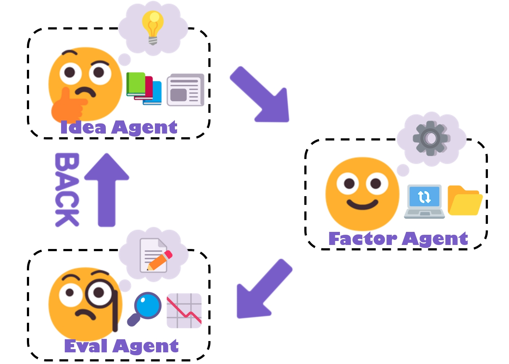

<h4 align="center">
  
  
  <a href="https://arxiv.org/abs/2502.16789"><b>📃Paper Link</b>👁️</a>
</h3>


# 📖Introduction
<div align="center">
      
</div>


<!-- Tag Cloud -->
**AlphaAgent** is an autonomous framework that effectively integrates LLM agents for mining interpretable and decay-resistant alpha factors through three specialized agents.  

- **Idea Agent**: Proposes market hypotheses to guide factor creation based on financial theories or emerging trends.  
- **Factor Agent**: Constructs factors based on hypotheses while incorporating regularization mechanisms to avoid duplication and overfitting. 
- **Eval Agent**: Validates practicality, performs backtesting, and iteratively refines factors via feedback loops.

This repository follows the implementation of [RD-Agent](https://github.com/microsoft/RD-Agent). You can find its repository at: [https://github.com/microsoft/RD-Agent](https://github.com/microsoft/RD-Agent). We would like to extend our sincere gratitude to the RD-Agent team for their pioneering work and contributions to the community.


# ⚡ Quick start

### 🐳 Docker installation.
Users must ensure Docker is installed before attempting most scenarios. Please refer to the [official 🐳Docker page](https://docs.docker.com/engine/install/) for installation instructions.


### 📈 Data Preparation
- For A-share market, stock data will be automatically downloaded to `~/.qlib/qlib_data/cn_data`.

- Alternatively, you can mannully download Chinese stock data via baostock and dump into the Qlib format.
  ```sh
  # Download or update stock data from baostock
  python prepare_cn_data.py


  cd ..
  # Clone Qlib source code
  git clone https://github.com/microsoft/qlib.git
  cd qlib

  # Convert csv to Qlib format
  python scripts/dump_bin.py dump_all ... \
  --include_fields open,high,low,close,preclose,volume,amount,turn,pctChg,peTTM,pbMRQ,psTTM,pcfNcfTTM,isST,factor \
  --csv_path  ~/.qlib/qlib_data/cn_data/raw_data_now \
  --qlib_dir ~/.qlib/qlib_data/cn_data \
  --date_field_name date \
  --symbol_field_name code

  # Collect calendar data
  python scripts/data_collector/future_calendar_collector.py --qlib_dir ~/.qlib/qlib_data/cn_data/ --region cn


  # Download the CSI500/CSI300/CSI100 stock universe
  python scripts/data_collector/cn_index/collector.py --index_name CSI500 --qlib_dir ~/.qlib/qlib_data/cn_data/ --method parse_instruments
  ```

- You can modify backtest configuration files which are located at:
  - Baseline: `alphaagent/scenarios/qlib/experiment/factor_template/conf.yaml`
  - For Newly proposed factors: `alphaagent/scenarios/qlib/experiment/factor_template/conf_cn_combined.yaml`

### 🐍 Create a Conda Environment
- Create a new conda environment with Python (3.10 and 3.11 are well-tested in our CI):
  ```sh
  conda create -n alphaagent python=3.10
  ```
- Activate the environment:
  ```sh
  conda activate alphaagent
  ```

### 🛠️ Install locally
- 
  ```sh
  # Install AlphaAgent
  pip install .

  # Or install the package in editable mode.
  pip install -e .
  ```

### 💊 Health check
- We provide a health check that currently checks two things.
  - whether the docker installation was successful.
  - whether the default port is occupied.
  ```sh
  alphaagent health_check
  ```


### ⚙️ Configuration
- For the official OpenAI API, simply set up your `OPENAI_API_KEY` in the `.env` file.
- If you're using an unofficial API provider, ensure both `OPENAI_BASE_URL` and `OPENAI_API_KEY` are configured in the `.env` file.


### 🚀 Run AlphaAgent

- Before starting your run, ensure that Docker is installed on your machine. You can verify the installation by running the following command:

  ```bash
  docker --version
  ```
- Additionally, ensure that your user has the necessary permissions to execute Docker commands without requiring sudo. To achieve this, add your user to the docker group by running the following command:
  ```bash
  sudo usermod -aG docker $USER
  ```

  After running the command, log out and log back in for the changes to take effect. 

- Run **AlphaAgent** based on [Qlib Backtesting Framework](http://github.com/microsoft/qlib).
  ```sh
  alphaagent mine --potential_direction "<YOUR_MARKET_HYPOTHESIS>"
  ```

- Alternatively, run the following command
  ```sh
  dotenv run -- python alphaagent/app/qlib_rd_loop/factor_alphaagent.py --direction "<YOUR_MARKET_HYPOTHESIS>"
  ```

- Multi-factor backtesting
  ```sh
  alphaagent backtest --factor_path "<PATH_TO_YOUR_CSV_FILE>"
  ```

  Your factors need to be stored in a `.csv` file. Here is an example:
  ```csv
  factor_name,factor_expression
  MACD_Factor,"MACD($close)"
  RSI_Factor,"RSI($close)"
  ```


- If you need to rerun the baseline results or update backtest configs, remove the cache and log folders:
  ```sh
  rm -r ./pickle_cache/*
  rm -r ./log/*
  rm -r ./git_ignore_folder/*
  ```

### 🖥️ Monitor the Application Results
- You can run the following command for our demo program to see the run logs.

  ```sh
  alphaagent ui --port 19899 --log_dir log/
  ```

- Activate the alpha mining entrance from the ui. 

  ```sh
  uvicorn backend.main:app --reload --port 9000
  ```
