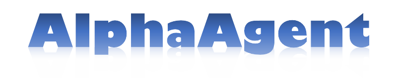
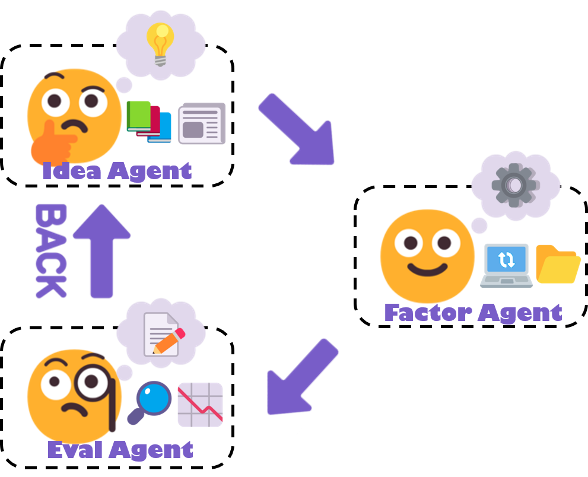

<h4 align="center">
  
  
  <a href="https://arxiv.org/abs/2502.16789"><b>📃Paper Link</b>👁️</a>
</h3>


<!-- # 📰 News
| 🗞️ News        | 📝 Description                 |
| --            | ------      
| Kaggle Scenario release | We release **[Kaggle Agent](https://rdagent.readthedocs.io/en/latest/scens/kaggle_agent.html)**, try the new features!                  |
| Official WeChat group release  | We created a WeChat group, welcome to join! (🗪[QR Code](docs/WeChat_QR_code.jpg)) |
| Official Discord release  | We launch our first chatting channel in Discord (🗪[](https://discord.gg/ybQ97B6Jjy)) |
| First release | **RDAgent** is released on GitHub | -->


# 📖Introduction
<div align="center">
      
</div>


<!-- Tag Cloud -->
**AlphaAgent** is an autonomous framework that effectively integrates LLM agents for mining interpretable and decay-resistant alpha factors through three specialized agents.  

- **Idea Agent**: Proposes market hypotheses to guide factor creation based on financial theories or emerging trends.  
- **Factor Agent**: Constructs factors based on hypotheses while incorporating regularization mechanisms to avoid duplication and overfitting. 
- **Eval Agent**: Validates practicality, performs backtesting, and iteratively refines factors via feedback loops.

This repository follows the implementation of [RD-Agent](https://github.com/microsoft/RD-Agent). You can find its repository at: [https://github.com/microsoft/RD-Agent](https://github.com/microsoft/RD-Agent). We would like to extend our sincere gratitude to the RD-Agent team for their pioneering work and contributions to the community.


# ⚡ Quick start

### 🐳 Docker installation.
Users must ensure Docker is installed before attempting most scenarios. Please refer to the [official 🐳Docker page](https://docs.docker.com/engine/install/) for installation instructions.

### 🐍 Create a Conda Environment
- Create a new conda environment with Python (3.10 and 3.11 are well-tested in our CI):
  ```sh
  conda create -n alphaagent python=3.10
  ```
- Activate the environment:
  ```sh
  conda activate alphaagent
  ```

### 🛠️ Install locally\
- Install the package in editable mode.
  ```sh
  pip install -e .
  ```

### 💊 Health check
- We provide a health check that currently checks two things.
  - whether the docker installation was successful.
  - whether the default port is occupied.
  ```sh
  alphaagent health_check
  ```


### ⚙️ Configuration
- For the official OpenAI API, simply set up your `OPENAI_API_KEY` in the `.env` file.
- If you're using an unofficial API provider, ensure both `OPENAI_BASE_URL` and `OPENAI_API_KEY` are configured in the `.env` file.


### 🚀 Run AlphaAgent

- Run **AlphaAgent** based on [Qlib Backtesting Framework](http://github.com/microsoft/qlib).
  ```sh
  dotenv run -- python alphaagent/app/qlib_rd_loop/factor_alphaagent.py --potential_direction "<YOUR_MARKET_HYPOTHESIS>"
  ```


- If you need to rerun the baseline results or update backtest configs, remove the cache and log folders:
  ```
  rm -r ./pickle_cache/*
  rm -r ./log/*
  rm -r ./git_ignore_folder/*
  ```

### 🖥️ Monitor the Application Results
- You can run the following command for our demo program to see the run logs.

  ```sh
  rdagent ui --port 19899 --log_dir log/
  ```
